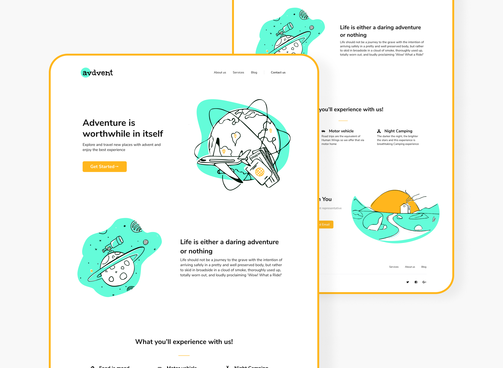

# Avdent Landing Page Website

Day 001 : FIGMA TO CODE CHALLENGE

---

The challenge is quite simple, if you want to join. Pick a design from any #figma user whether your own or someone else's design and build the UI out using any of the frontend tools.#100DaysOfCode

---

## Rules of the Challenge

- Give credit to the designer
- Show your work

## Live Preview

[Live Preview](https://advent-landing.vercel.app/)

## Design Credit

Vishwajeet patil

- [Twitter Profile](http://www.twitter.com/vishpatiltweets)
- [Website](https://vishpatil.myportfolio.com/)

Dribble Shot



## Requirements

This project have some requeriments you need to meet in order to compile it. First of all, you need NodeJS in order to run javascript on the console, you can go to the [NodeJS](http://nodejs.org) site and follow trough the installation process. After you get the `node` command on the console you will have the node package manager `npm` as well. Now you need to install Gulp with the following command.

```
npm install -g gulp
```

Gulp is the one that will run all the compilation, watchers and others tasks. To learn more about Gulp and all it's magical abilities check out there website [here.](https://gulpjs.com/)

---

## Install and Run

In order to start using the project you need to clone it to your computer. You can download the the zip version.

After you have it on you pc, you need to go in the console to the project folder and execute the following command to gather all the dependencies.

```
npm install
```

```
gulp
```

---

## How to use

If you want to use SCSS or LESS feel free to make that change in the file types and update the gulpfile to look for the right file types also.

Feel free to add onto this project by forking it and making it your own, This is just a basic start but work for most basic project without a lot of fancy bells and whistles.

Cheers 👍🏼

# kp-starter-project
