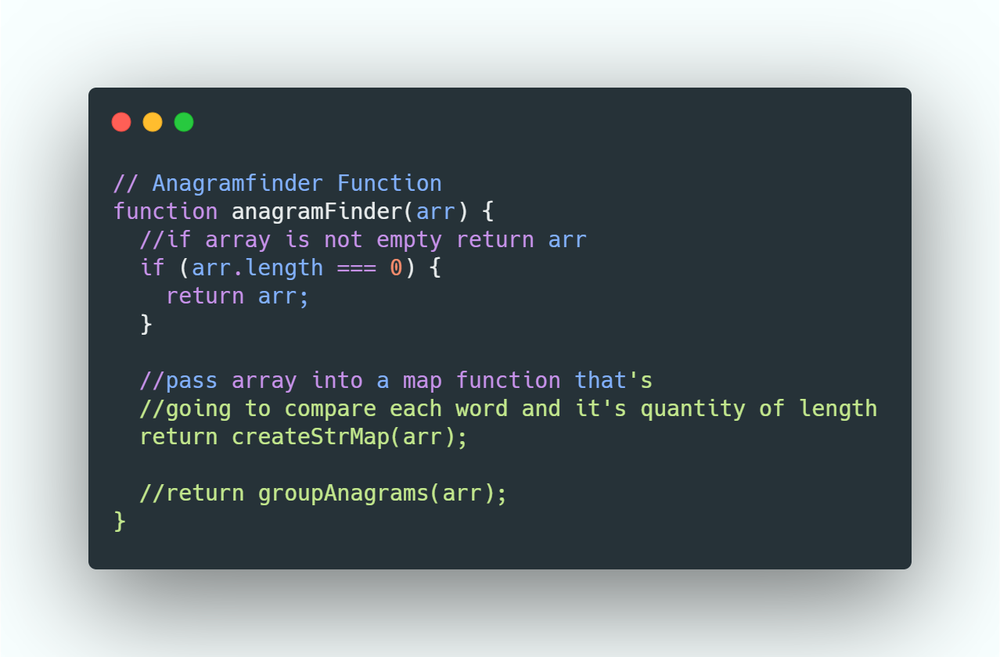
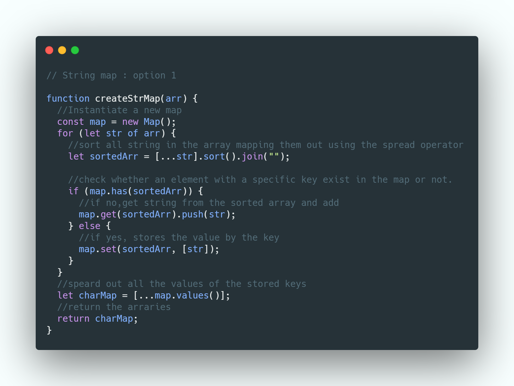
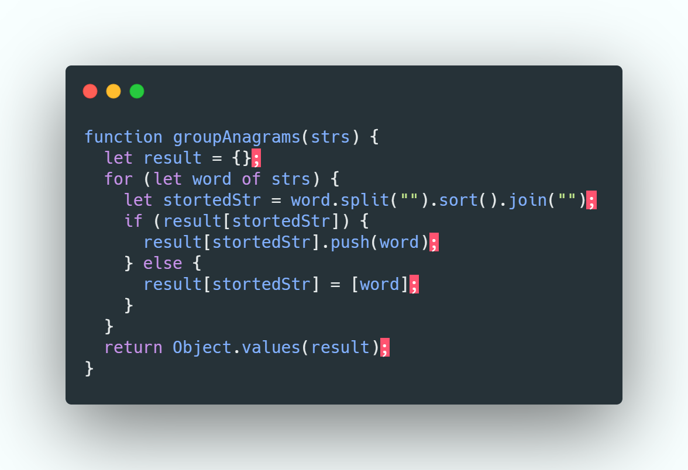
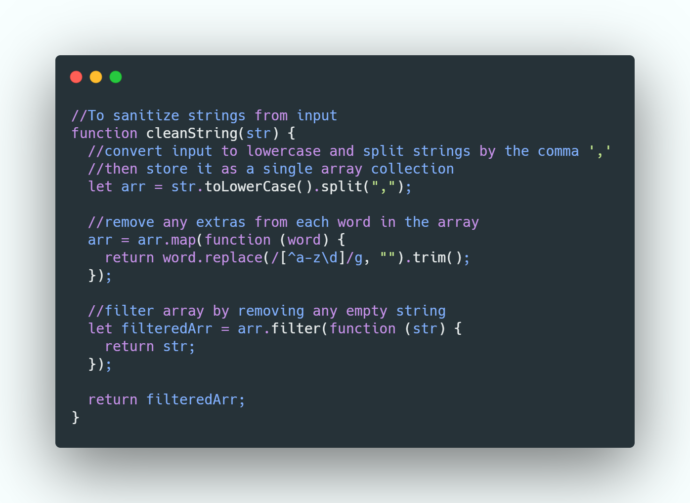
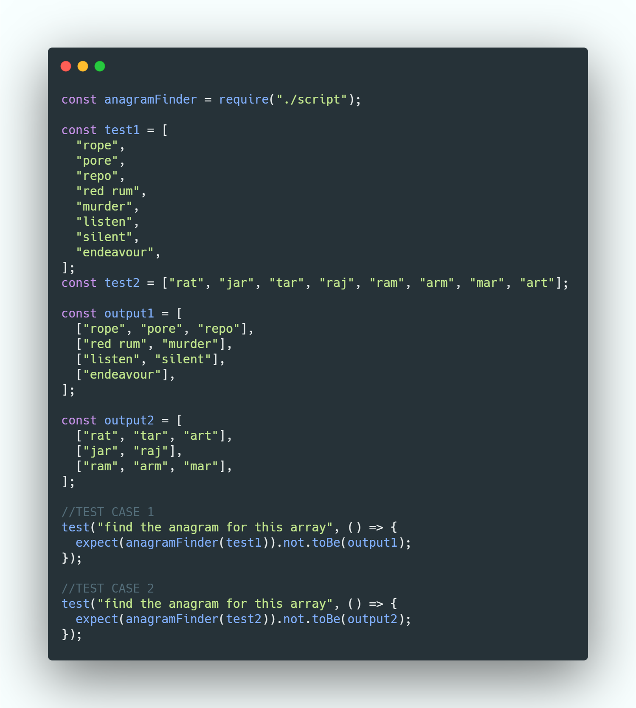
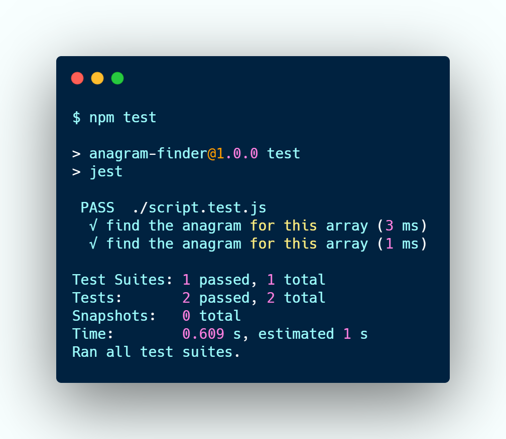

# Pxlwidget Client-Side-Programming Assessment

### - Links to Source Codes

- [Case-Study-1-Code] - Anagram Finder Source
- [Case-Study-2-Code] - Rijks Musuem API Website Source

### - Links to Live Preview

- [Case-Study-1-live]-Anagram Finder Live Preview
- [Case-Study-2-Live] Rijks Musuem API Website Source

## Case Study 1 : Anagram Finder

create a program that takes a list of any number of strings and will
determine which words in the list are exact anagrams of each other (ignoring spaces). For example, if the
input to the program is:
[
'rope',
'pore',
'repo',
'red rum',
'murder',
'listen',
'silent',
'endeavour',
]
The output should be:
[
['rope', 'pore', 'repo'],
['red rum', 'murder'],
['listen', 'silent'],
['endeavour'],
]

## Table of Content

- What's Anagram
- The Challenge
- Algorithmic Thinking
- Code Implementation
- Testing
- Pracrical Example

## What's Anagram

> A word is said to be an anagram of another when it can be formed
> by rearranging the letters of the other word
> each letter just once.
> E.g listen is an anagram of silent

## The Challenge

Dillinger uses a number of open source projects to work properly:
And of course Dillinger itself is open source with a [public repository][dill]
on GitHub.

## Algorithmic Thinking

Dillinger requires [Node.js](https://nodejs.org/) v10+ to run.
Install the dependencies and devDependencies and start the server.

## Code Implementation

Dillinger is currently extended with the following plugins.
Instructions on how to use them in your own application are linked below.

## Testing

Want to contribute? Great!

Dillinger uses Gulp + Webpack for fast developing.
Make a change in your file and instantaneously see your updates!

## Practical Example

For production release:

## License

MIT

**Open for feedback and tips for improvements**

[case-study-1-code]: https://github.com/thekojopatrick/pxlwidget-coding-challenge/tree/main/anagram-finder
[case-study-1-live]: https://anagram-finder.vercel.app/
[case-study-2-code]: http://angularjs.org
[case-study-2-live]: http://angularjs.org
